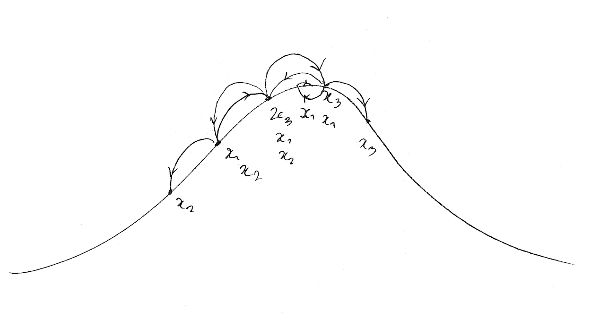
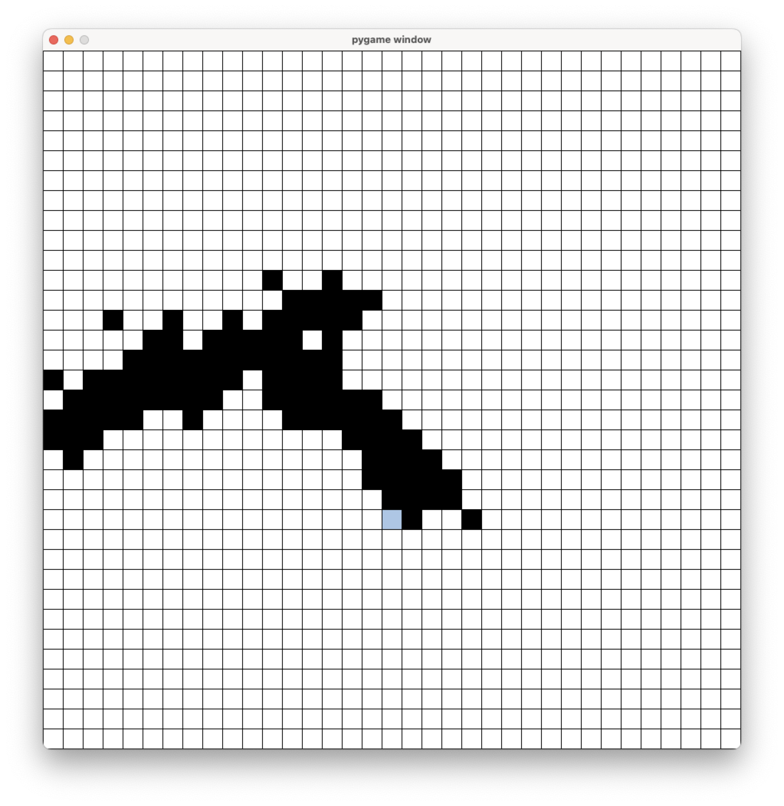

## [Starting to work on the Vesuvius Challenge](https://github.com/etiennedyer/vesuvius)
I'm developping an autosegmentation tool as part of the [Vesuvius Challenge](https://scrollprize.org/)

## [An n=1 trial on the effects of Vyvanse](https://etiennedyer.github.io/pages/vyvanse)
I ran a 30-day trial to figure out the effect my ADHD meds have on my productivity and mood.

## [Lead-acid battery recycling and Dodd-Frank 1502](https://leadbatteries.substack.com/p/from-conflict-minerals-to-clean-lead)
This is a piece I wrote about the relationship between demand-side regulation like Section 1502 of the Dodd-Frank act and lead policy.

## [Predicting Population Size](pages/pool.md)
This is a program I wrote in Python to answer questions of the type "If I sample from a pool 100 times, and 1 object appeared 3 times,  2 objects appeared twice, and every other object appear once, what is the most likely size of the pool?" (which I later learned biologists know as the [mark and recapture](https://en.wikipedia.org/wiki/Mark_and_recapture) process to estimate population sizes). It uses a Monte Carlo algorithm and recursive search to estimate the most likely pool size your sample came from.

## [The Angel Problem](pages/angel.md)
I got an undergraduate research grant to study the [angel problem](https://en.wikipedia.org/wiki/Angel_problem), as described by John Conway. I've developed an interactive tool in Python to explore the problem and illustrate parts of the proof. \
\

