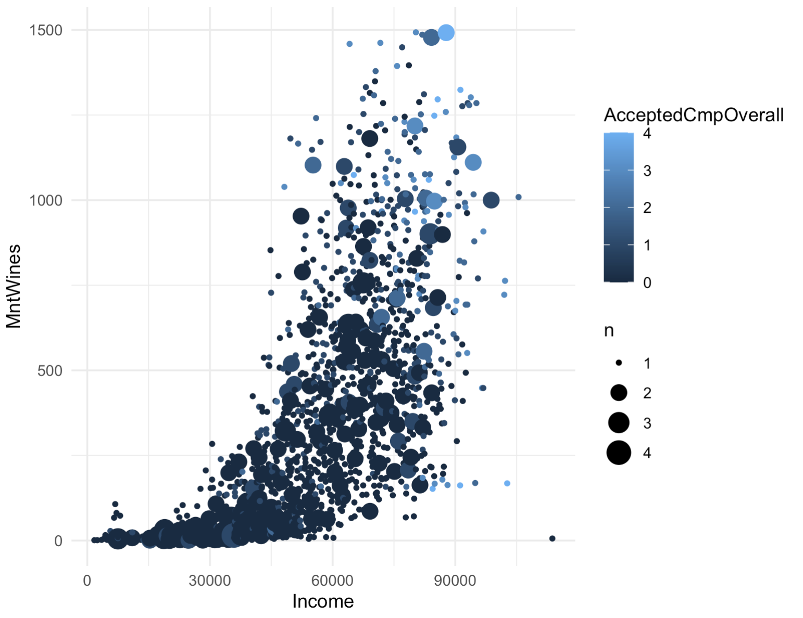

## [The Angel Problem](pages/angel.md)
I got an undergraduate research grant to study the angel problem, as described by John Conway. I've developped an interactive tool using python to explore the problem and illustrate parts of the proof. 

## [iFood Marketing Challenge](pages/ifood.md)
 Analysis and visualization of the iFood Marketing challenge data, prediction of response to marketing campaigns using random forest. 

## [Lead-acid battery recycling](https://leadbatteries.substack.com/)
I'm working with students at the university of Chicago on reforming policy in Nigeria surrounding lead-acid battery recycling. 
