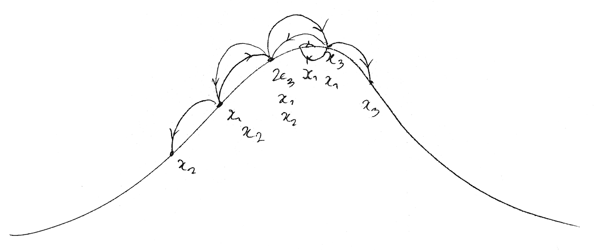

## [ComfyUI / VFX](pages/comfyui)
I worked a lot with ComfyUI this summer on the first version version of [Bronte](brontevfx.com), which was supposed to be a [Runway Aleph](https://runwayml.com/research/introducing-runway-aleph)-style tool. I didn't really have much to show for it, because I wasn't happy with the results, but I wanted to share my thoughts here because I definitely learned a lot.

## [Poker Coach](https://github.com/etiennedyer/poker-coach)
Little webapp I made to learn GTO-ish poker. Lots I want to add / fix, but I thought I'd share it here. The [repo](https://github.com/etiennedyer/poker-coach) is public if anyone wants to contribute! 

## [Bronte](https://brontevfx.com) ##
My main focus right now is Bronte, an AI agent for the VFX industry. Here's our website, going to start beta testing the Houdini plugin over the next few months!  

## [Weaver](https://weavestories.xyz) ##
Check out my LLM-based storybuilder website! Would love feedback, have some more features I want to implement soon.  

## [Rendering Engine](https://github.com/etiennedyer/graphics) ##
I've been building a C++ / OpenGL-based rendering engine to learn GPU and graphics programming. This repo contains some OpenGL code and thoughts on graphics in general.

## [Graph neural diffusion](https://github.com/etiennedyer/grand)
This repo contains the work I did for my honours project, where I studied the [GRAND](https://arxiv.org/abs/2106.10934) GNN architecture, specifically evaluating the claim that their model is especially resistant to oversmoothing.  
 

## [Starting to work on the Vesuvius Challenge](https://github.com/etiennedyer/vesuvius)
I've been developing an autosegmentation tool as part of the [Vesuvius Challenge](https://scrollprize.org/). It uses DBSCAN for initial segmenting, and I'm currently working on implementing a step to correct low-confidence regions according to data from high-confidence regions using Bayesian inference.  
 

## [An n=1 trial on the effects of Vyvanse](https://etiennedyer.github.io/pages/vyvanse)
I ran a 30-day trial to figure out the effect my ADHD medication has on my productivity and mood.

## [Lead-acid battery recycling and Dodd-Frank 1502](https://leadbatteries.substack.com/p/from-conflict-minerals-to-clean-lead)
This is a piece I wrote about the relationship between demand-side regulation like Section 1502 of the Dodd-Frank act and lead policy.

## [Predicting Population Size](pages/pool.md)
This is a program I wrote in Python to answer questions of the type "If I sample from a pool 100 times, and 1 object appeared 3 times,  2 objects appeared twice, and every other object appear once, what is the most likely size of the pool?" (which I later learned biologists know as the [mark and recapture](https://en.wikipedia.org/wiki/Mark_and_recapture) process to estimate population sizes). It uses a Monte Carlo algorithm and recursive search to estimate the most likely pool size your sample came from.

## [The Angel Problem](pages/angel.md)
I got an undergraduate research grant to study the [angel problem](https://en.wikipedia.org/wiki/Angel_problem) under Nadia Lafrenière and Assaf Shani. I've developed an interactive tool in Python to explore the problem and illustrate parts of the proof. \
 

